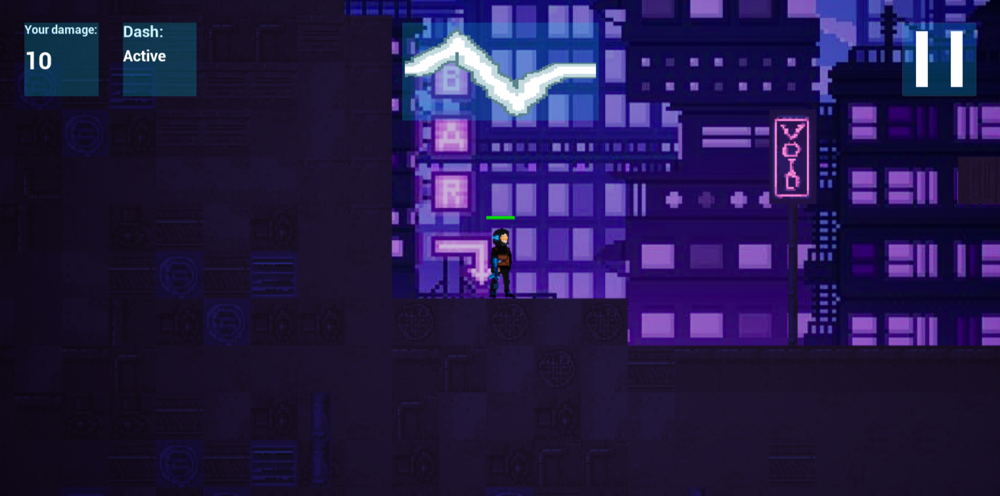
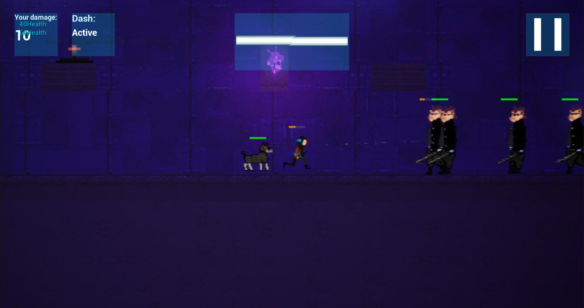
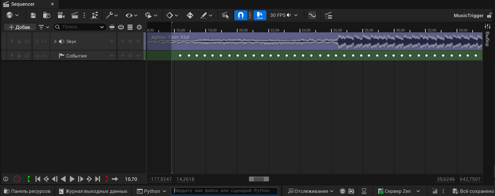

# it-clinic-gamedev
## Содержание
* [Описание проекта](#описание-проекта)
* [Технологии разработки](#технологии-разработки)
* [Установка и запуск](#установка-и-запуск-для-разработчиков)
* [Геймплей и механики](#геймплей-и-механики)
* [Команда](#команда)
* [Автоматизация расстановки таймингов](#Автоматизация-расстановки-таймингов)

## Описание проекта

Проект для учебной практики it-clinic СПБГУ. Проект является групповым.
Игра представляет собой 2D-шутер с ключевой механикой - попаданием в ритм для увеличения урона.

**Уникальность (USP)**

Игра сочетает в себе сразу два жанра: action-платформер и ритм-игру.
В обычных ритм-играх действия очень ограничены и направлены лишь на "попадание в ритм". В нашей же игре мы расширяем возможности и позволяем игроку свободно передвигаться, атаковать врагов и увеличивать наносимый урон.

На данный момент на рынке нет подобного сочетания action-платформера и ритм-игры.
Наличие музыкальной составляющей разнообразит тривиальный геймплей action-платформеров.

**Референсы**
- Katana zero (платформер)   Разработчик: https://katanazero.com/   Steam: https://store.steampowered.com/app/460950/Katana_ZERO/?l=russian
- Ритм-игры:
    + muse dash   Разработчик: https://musedash.peropero.net/#/version   Steam: https://store.steampowered.com/app/774171/Muse_Dash/
    + beat saber   Разработчик: https://beatsaber.com/   Steam: https://store.steampowered.com/app/620980/Beat_Saber/

## Технологии разработки
* Unreal Engine 5.6
* C++
* Blueprint Visual Scripting
* Генерация музыки - suno.ai
* Генерация визуала - ChatGPT

## Установка и запуск (для разработчиков)

Для работы над проектом необходимо следующее:

- установить unreal Engine (весит около 30гб, версии 5.x точно поддерживаются) Скачать: [Epic Games Launcher](https://www.unrealengine.com/)
- установить Visual Studio с пакетами "Game development with C++" и ".NET desktop development"
- склонировать данный репозиторий и сгенерировать .sln файл через редактор Unreal

Для редактирования C++ кода открывайте .sln файл. Для работы с Blueprint, уровнями и ассетами используйте Unreal Editor.

## Геймплей и механики
     
**Описание игрового процесса**

Задача игрока - сражаться с противниками, чтобы добраться до конца уровня и остаться в живых. Как говорилось ранее, важной частью геймплея является взаимодействие с музыкой: при стрельбе за попадание в такт происходит усиление атаки.

**Character, camera, control**

Персонаж – человек, солдат будущего, испытывающий секретный прибор, и в ходе выполнения задания попавший в окружение.
Камера – 2D, вид сбоку.

| Действие | Управление |
|----------|------------|
| Движение | W, A, S, D |
| Стрельба | ЛКМ        |
| Рывок    | ПКМ        |
| Прыжок   | Пробел     |

**Антураж, сеттинг**

Киберпанк-будущее, высокие технологии.
Персонаж попал в окружение. Перед выходом на задание ему в качестве эксперимента выдали секретный прибор, который позволяет воспроизводить ритм для сражения, исходя из анализа поведения врага.

**Механики:**

- Стрельба, ограниченное здоровье игрока
- Взаимодействие с музыкой. Если при выстреле игрок попадает в такт музыки на фоне, урон его выстрела усиливается. У этого усиления есть таймер - если игрок не попадает выстрелом в следующий такт музыки, усиление сбрасывается

 На переднем плане экрана - закреплённая панель со шкалой, демонстрирующей музыкальный бит.

**Противники:**
- **Силач** - ближний бой, много здоровья, высокий урон
- **Солдат** - дальний бой, слабый урон, мало здоровья
- **Робопёс** - ближний бой, мало урона и о.з., но высокая скорость атаки и передвижения, может прыгать
- **Снайпер** - дальний бой, мало о.з. и урона, однако обездвиживает каждым попаданием на несколько секунд

**Ловушки:** 
- «Электронная мина» отключает музыкальную механику на некоторое время
- «Взрывная мина» наносит урон персонажу. Мины нужно либо перепрыгнуть, либо обезвредить выстрелом с расстояния

## Автоматизация расстановки таймингов
 В проекте реализован удобный инструмент(скрипт) для автомитечской расстановки битов в музыкальном файле. Скрипт работает такбим образом, что из музыкального файлы вычисляет моменты ритма и записывает все эти моменты в CSV файл. А после, скрипт расставляет триггеры по таймингам в музыкальной дорожке.
 Пример работы скрипта:

 

## Команда
* 1artem11semenov1 — Team Lead, разработка
* nikitanasibullin — геймдизайн, разработка
* ddzina, SerjVankovich, vagra348, rOmannn299 - разработка
* AlimG11 - разработка 
